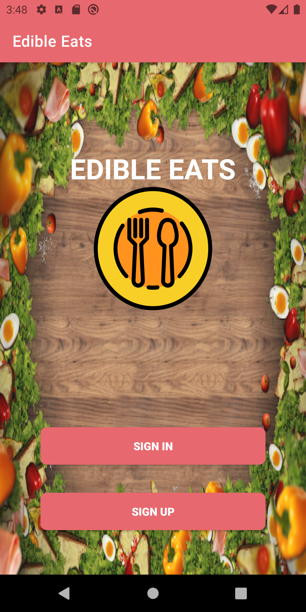

# Description

Edible Eats is an app that allows users to get a list of restaurants within the College Park, MD area that meet their dietary restrictions/preferences. Currently, Edible Eats offers support for pescatarian, vegan, vegetarian, and ketogenic diets.

Users initially choose their diet from a drop down menu, select their preference of favorite foods that correspond to the diet and then on submission obtain a list of restaurants. A user can set their profile name and even view the diet descriptions within the menu options. This provides further personalization and ensures users are making the most informed decisions within the app. After choosing preferences, a list of restaurants and corresponding location in or around the College Park area is displayed. A user can click a restaurant to view the menu choices that matched their preferences.

Edible Eats was developed by Gal Fudim, Tytan Taliaferro, and Aimon Sajid in December 2020 as a final project for CMSC436 at the University of Maryland, College Park.

# Screenshots

